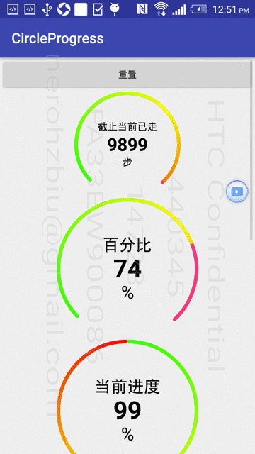

# 圆形进度条
仿 QQ 健康计步器的圆形进度条，基本满足日常需求。不支持设置圆弧半径，半径由 View 自行计算得出。

## 效果
效果如下：


## XML 配置
通过 XML 可以配置出多种效果，支持配置属性如下：

```xml
<declare-styleable name="CircleProgressBar">
   <!-- 是否开启抗锯齿 -->
   <attr name="antiAlias" format="boolean" />
   <!-- 绘制内容相应的提示语 -->
   <attr name="hint" format="string|reference" />
   <attr name="hintSize" format="dimension" />
   <attr name="hintColor" format="color|reference" />
   <!-- 绘制内容的单位 -->
   <attr name="unit" format="string|reference" />
   <attr name="unitSize" format="dimension" />
   <attr name="unitColor" format="color|reference" />
   <!-- 绘制内容的数值 -->
   <attr name="maxValue" format="float" />
   <attr name="value" format="float" />
   <!-- 精度，默认为0 -->
   <attr name="precision" format="integer" />
   <attr name="valueSize" format="dimension" />
   <attr name="valueColor" format="color|reference" />
   <!-- 圆弧颜色，设置多个可实现渐变 -->
   <attr name="arcColor1" format="color|reference" />
   <attr name="arcColor2" format="color|reference" />
   <attr name="arcColor3" format="color|reference" />
   <!-- 圆弧宽度 -->
   <attr name="arcWidth" format="dimension" />
   <!-- 圆弧起始角度，3点钟方向为0，顺时针递增，小于0或大于360进行取余 -->
   <attr name="startAngle" format="float" />
   <!-- 圆弧度数 -->
   <attr name="sweepAngle" format="float" />
   <!-- 当前进度百分比 -->
   <!--<attr name="percent" format="float"/>-->
   <!-- 设置动画时间 -->
   <attr name="animTime" format="integer" />
   <!-- 背景圆弧颜色 -->
   <attr name="bgArcColor" format="color|reference" />
   <!-- 背景圆弧宽度 -->
   <attr name="bgArcWidth" format="dimension" />
</declare-styleable>
```

## 代码
考虑到圆弧大小、圆弧起始角度等属性一般不可能动态改变，所以通过代码并不能设置 CircleProgress 的全部属性。具体支持方法可以查看 `CircleProgress.java` 中的 `setter` 方法。


